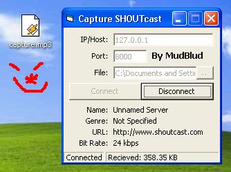



## SHOUTcast Stream Capture \*UPDATED\!\*

### Description

*UPDATED* this cool lil program downloads music from a SHOUTcast server into a file on your computer, it also grabs the server info (name,genre,url and bitrate) which i haven't seen any other SHOUTcast s/c's on here do! :) it also tells you how many bytes,kbs,mbs or gbs of mp3 u have downloaded. please vote and leave feedback
 
### More Info
 

             |
---                |---
**Submitted On**   |2002-02-06 16:26:36
**By**             |[Mud Blud](https://github.com/Planet-Source-Code/PSCIndex/blob/master/ByAuthor/mud-blud.md)
**Level**          |Intermediate
**User Rating**    |5.0 (30 globes from 6 users)
**Compatibility**  |VB 5\.0, VB 6\.0
**Category**       |[Sound/MP3](https://github.com/Planet-Source-Code/PSCIndex/blob/master/ByCategory/sound-mp3__1-45.md)
**World**          |[Visual Basic](https://github.com/Planet-Source-Code/PSCIndex/blob/master/ByWorld/visual-basic.md)
**Archive File**   |[SHOUTcast\_53446262002\.zip](https://github.com/Planet-Source-Code/mud-blud-shoutcast-stream-capture-updated__1-31543/archive/master.zip)

